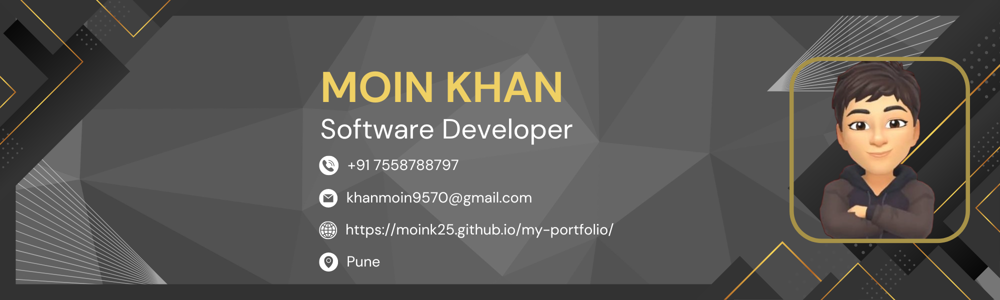

  

# Hey, I'm Moin! 👋
### 🚀 Aspiring Software Engineer | AI Enthusiast | Web Developer

---

## 💫 About Me:

### 🎯 Professional Background:
- 🔭 Currently working on **AI Projects** to advance my expertise in machine learning and deep learning.
- 🌱 Learning **Data Structures and Algorithms (DSA)** to improve my problem-solving skills.
- 👯 Seeking to **collaborate on Web Development and AI** projects, combining my knowledge in both fields.
- 🤝 Always open to learning and getting assistance with **DevOps** tools and technologies.

---

## 🚧 Work:

- ⚡ **AI Projects**: Working on machine learning and deep learning projects to gain hands-on experience in the field.
- 💻 **Web Development**: Building responsive, dynamic websites using technologies like React, Tailwind CSS, and more.
- 🔍 **Cricket Ball Tracking Project**: A current Python-based project analyzing cricket ball trajectories.
- 📊 **Log Analyzer**: Developed a tool for advanced log analysis using Lex language.

---

## 🎯 Goals:

- 🏆 **Contribute to Open Source**: I aim to actively contribute to open-source projects, enhancing my learning and helping the community.
- 🤖 **Master AI/ML**: Deepen my understanding of AI/ML algorithms and their practical applications in real-world projects.
- 🚀 **Expand DevOps Skills**: Continue learning tools and technologies in the DevOps ecosystem, like Docker and Kubernetes.
- 🌐 **Web Development Mastery**: Refine my full-stack development skills and build more complex, feature-rich web applications.

---

## 🌐 Connect with Me:

  
  
  
  
  

---

## 📊 GitHub Stats:

  
  

  

---

## 🏆 GitHub Trophies:

  

---

## ✍️ Inspirational Dev Quote:

  

---

## 🔝 Top Contributed Repos:

  

---

## 🔄 Recent Activity:
<!--START_SECTION:activity-->
1. 🗣 Commented on [#123](https://github.com/Moink25/some-repo/issues/123) in `Moink25/some-repo`
2. ❗️ Closed issue [#456](https://github.com/Moink25/other-repo/issues/456) in `Moink25/other-repo`
3. 🎉 Merged PR [#789](https://github.com/Moink25/another-repo/pull/789) in `Moink25/another-repo`
<!--END_SECTION:activity-->

---

## 🔢 GitHub Visitor Count:

  

---

  

<!-- Credits: https://github.com/anuraghazra/github-readme-stats, https://github.com/ryo-ma/github-profile-trophy, https://github.com/DenverCoder1/github-readme-streak-stats -->
